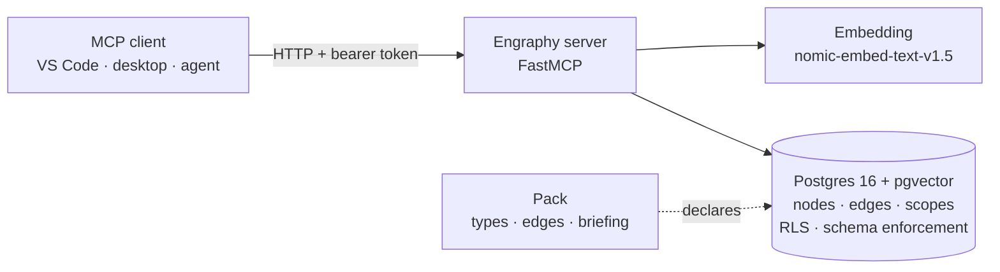

# Engraphy

**Associative memory for AI agents, modelled on the human mind.**

[](https://github.com/devon-clarkk/engraphy/actions/workflows/ci.yml)
[](https://github.com/devon-clarkk/engraphy/releases/latest)
[](LICENSE)
[](https://www.python.org/downloads/)
[](https://github.com/pgvector/pgvector)

[Quickstart](#quickstart) · [Documentation](docs/) · [Tool reference](docs/04-tools-reference.md) · [Design set](design/README.md) · [Contributing](CONTRIBUTING.md)

The name comes from *engraphy*, an old term from memory science for the process
of laying down an *engram*, the trace a memory leaves in the brain. Engraphy
does that for agents: it checks each new memory against what it already knows
before the write lands, merging restatements, linking genuinely new facts, and
never silently overwriting. Nothing is deleted, so history stays walkable.

Engraphy is self-hosted. It stores what an agent learns as a typed knowledge
graph on Postgres + [pgvector](https://github.com/pgvector/pgvector): writes
deduplicate themselves against existing memory, retrieval fuses semantic and
lexical search, isolation between users is enforced by the database, and the
whole shape of memory is declared per application as a **pack**.

It exists to replace the reference MCP memory server's flat-JSON, single-user,
stdio model with something that survives concurrency, paraphrase, duplicates, and
years of accumulated memory. It speaks the [Model Context Protocol](https://modelcontextprotocol.io),
so any MCP client (a VS Code extension, a desktop app, another agent) can use it
over HTTP.

> **Source-available.** Licensed under the Business Source License 1.1: read it,
> run it, build on it, and use it in production for your own product. Offering
> Engraphy itself as a hosted or managed service to third parties is reserved to
> the Licensor until the Change Date, when it converts to Apache-2.0. See
> [License](#license).

---

## What it does

- **A typed memory graph.** Memories are typed **nodes** (`fact`, `decision`,
  `person`, `event`, …) joined by typed **edges** (`involves`, `references`,
  `supersedes`, …). The types, their attribute schemas, and the rules for which
  edges may connect which types are declared per space in a **pack** and enforced
  in Postgres.
- **Writes that deduplicate themselves.** Every write is embedded and banded
  against existing memory. A near-verbatim restatement auto-merges; a genuinely
  new but related fact is kept as its own searchable node and joined by an edge
  (nothing is silently absorbed); a borderline case parks as a pending
  duplicate-check verdict for the caller to resolve. Every write returns a
  *resonance report* of what it touched.
- **Hybrid retrieval.** `search` fuses a vector leg (cosine over embeddings) and a
  lexical leg (Postgres full-text) with Reciprocal Rank Fusion, and `traverse`
  walks the edges. Attribute values are folded into the searchable surface, so a
  fact stored only in a typed attribute is still findable.
- **Isolation the database enforces.** Multiple spaces, and multiple principals
  within a space, are separated by Postgres Row-Level Security running under a
  non-superuser role, not by application checks that can be forgotten. The server
  connects as a `NOBYPASSRLS` role.
- **Scope routing built for LLMs.** Every scope carries a description of what it
  governs; the read-only `scope_guide` tool returns that routing manifest so an
  agent can decide *where* a new memory belongs before it writes.
- **An operator CLI and an MCP tool surface** for everything from bootstrapping a
  space to minting tokens, importing data, applying packs, and verifying restores.

## How it works



A **write** is embedded, banded by similarity into merge / merge-link / pending /
new, and committed under the caller's identity. A **read** (`search`, `get`,
`traverse`, `briefing`) runs under RLS so a caller only ever sees the scopes they
were granted. A **pack** declares the node types, edge types, attribute schemas,
and session-start briefing for a space, so one engine serves many differently
shaped memory applications. The [architecture overview](docs/01-architecture.md)
walks the full write and read paths.

## Quickstart

Requirements: Docker (with Compose). The cloud profile brings up Postgres, runs
migrations, provisions the app role, and starts the server in one command.

```bash
# 1. Configure secrets (never committed)
cp deploy/.env.example .env   # then edit, or:
printf 'POSTGRES_PASSWORD=%s\nENGRAPHY_APP_ROLE_PASSWORD=%s\n' \
  "$(openssl rand -hex 16)" "$(openssl rand -hex 16)" > .env

# 2. Bring up Postgres + migrate + provision + serve
docker compose up -d          # the embedding model ships baked into the image

# 3. Create a space, apply the starter pack, mint a client token
docker compose --profile admin run --rm admin \
  engraphy-admin space create --id personal --display-name "My Memory" --principal me
docker compose --profile admin run --rm admin \
  engraphy-admin pack apply packs/starter/pack.yaml --space personal
docker compose --profile admin run --rm admin \
  engraphy-admin token create --space personal --principal me \
    --client-name my-editor --role readwrite
```

The server is now on `127.0.0.1:8000` (put a TLS-terminating reverse proxy in
front to expose it). Point any MCP client at it with the bearer token. The
[setup guide](docs/02-setup.md) covers the local, no-Docker path as well.

### Or let the scripts do it

`up.sh` and `provision.sh` (with `up.ps1` / `provision.ps1` as Windows
equivalents) wrap exactly the sequence above, and add the waiting that a
copy-paste quickstart cannot:

```bash
./up.sh          # writes .env with random passwords, starts the stack,
                 # then blocks until /healthz returns 200
./provision.sh   # creates the space, applies the starter pack, mints a token,
                 # and prints the client settings to paste in
```

`up.sh` polls `/healthz` rather than compose's health status, because on first
boot compose reports `starting` for as long as the model cache takes to seed,
which looks identical to a crash-loop from the outside. A 200 is the real signal.

Both scripts are safe to re-run: an existing `.env` is never overwritten, and an
existing space or an already-applied pack is skipped rather than treated as an
error, so a re-run still mints a fresh token.

Everything is parameterised, with defaults that work unchanged:

| | default | override |
|---|---|---|
| space id | `default` | `./provision.sh myspace` or `-Space myspace` |
| principal | `me` | `./provision.sh myspace alice` or `-Principal alice` |
| client name | `my-client` | third positional arg, or `-ClientName` |
| pack | `/app/packs/starter/pack.yaml` | `ENGRAPHY_PACK` or `-Pack` |
| host port | `8000` | `ENGRAPHY_HOST_PORT` in `.env`, or `-Port` |
| health timeout | 1800s up, 600s provision | `ENGRAPHY_WAIT_SECS` or `-WaitSeconds` |

The token is printed once and never written to disk by the scripts; the server
stores only its SHA-256. If you lose it, re-run `provision.sh` for a new one.

## Using it from a client

Engraphy is an MCP server, so a client connects and calls tools:

| Tool | What it does |
|------|--------------|
| `write` | Dedup-banded write; returns the node or a duplicate-check verdict plus a resonance report. |
| `search` | Hybrid semantic + lexical retrieval across one scope or all. |
| `traverse` | Recursive graph walk from a starting node. |
| `get` | Full nodes plus edge summaries, by id. |
| `briefing` | Pack-declared session-start sections (due commitments, relevant notes, …). |
| `scope_guide` | The routing manifest: every writable scope and what it governs. |
| `scope_list` / `scope_create` | List readable scopes / create a private one. |
| `link` · `update` · `supersede` · `resolve_duplicate` | Edit the graph and settle pending verdicts. |
| `pending_list` · `stats` · `inbox_review` | Inspect pending writes, usage metrics, and the capture inbox. |
| `admin_*` | Space administration (members, tokens, grants, visibility). |

See the [tool reference](docs/04-tools-reference.md) for parameters, returns, and
an example per tool. A first-party VS Code extension lives in
[`vscode-extension/`](vscode-extension/).

## Documentation

- **[docs/](docs/)**: developer documentation, [architecture](docs/01-architecture.md),
  [setup](docs/02-setup.md), [packs](docs/03-packs.md),
  [tool reference](docs/04-tools-reference.md), [deployment](docs/05-deployment.md),
  and an [end-to-end tutorial](docs/06-tutorial.md).
- **[design/](design/README.md)**: the design set, the data model, retrieval and
  dedup, auth and tenancy, operations, the pack/ontology system, and the
  benchmark harness. This is where the engineering reasoning lives.
- **[skills/](skills/)**: concise guidance an LLM agent can load to use Engraphy
  well (writing and dedup, retrieval, scopes and visibility, answer discipline).

## Requirements

- **Postgres 16** with **pgvector** (the `pgvector/pgvector:pg16` image ships both).
- **Python ≥ 3.12**.
- **[dbmate](https://github.com/amacneil/dbmate)** for migrations (bundled in the
  admin container; only needed on `PATH` for the no-Docker path).
- The embedding model **`nomic-ai/nomic-embed-text-v1.5`** (384-dim, int8 ONNX, ~131 MB,
  downloaded and cached on first boot).

## Project status

v0.1.0. The schema and enforcement kernel, engine behaviors (dedup, hybrid
retrieval, graph traversal, briefings), the MCP server with auth and admin, and
the operator CLI are implemented and covered by a live-Postgres test suite plus a
CI job that exercises the shipped deploy artifacts end to end. A benchmark harness
(`bench/`, design/09) runs the engine against public long-term-memory datasets;
it is a tool for measuring changes, not a source of marketing numbers.

## Contributing

Issues and pull requests are welcome. [`CONTRIBUTING.md`](CONTRIBUTING.md) covers
getting a development database up, running the suite, what the three CI jobs
check, and the house style. Security problems go through
[a private advisory](https://github.com/devon-clarkk/engraphy/security/advisories/new)
rather than a public issue.

## License

Engraphy is licensed under the **Business Source License 1.1** (see
[`LICENSE`](LICENSE)).

- **You may** read, modify, redistribute, self-host, and use Engraphy in
  production as the memory layer for your own applications and agents.
- **You may not** offer Engraphy itself to third parties as a hosted or managed
  service before the Change Date.
- **Change Date:** 2026-08-22 + 4 years (**2030-08-22**), on which the license
  converts to the **Apache License, Version 2.0**.

Copyright (c) 2026 Devon Clark.
