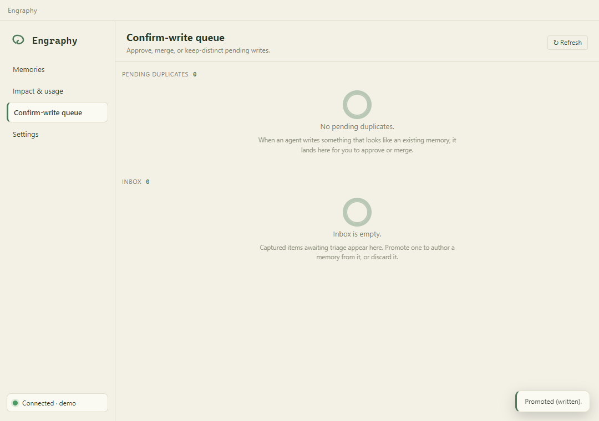
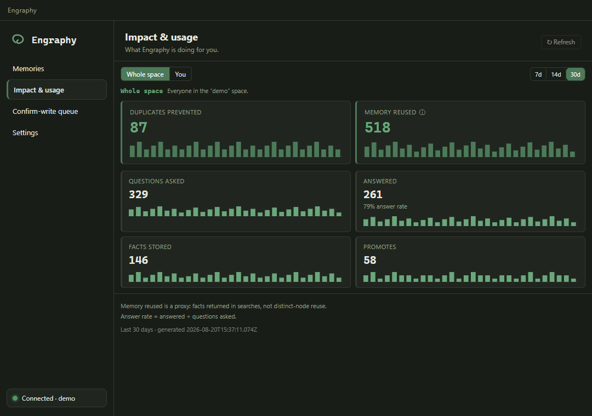
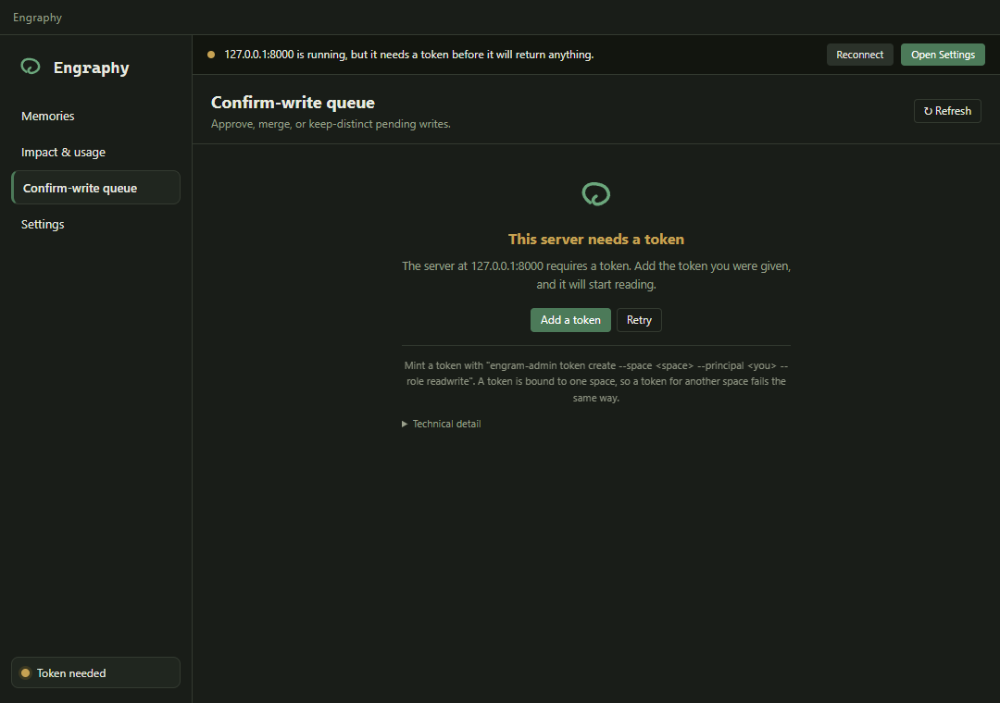
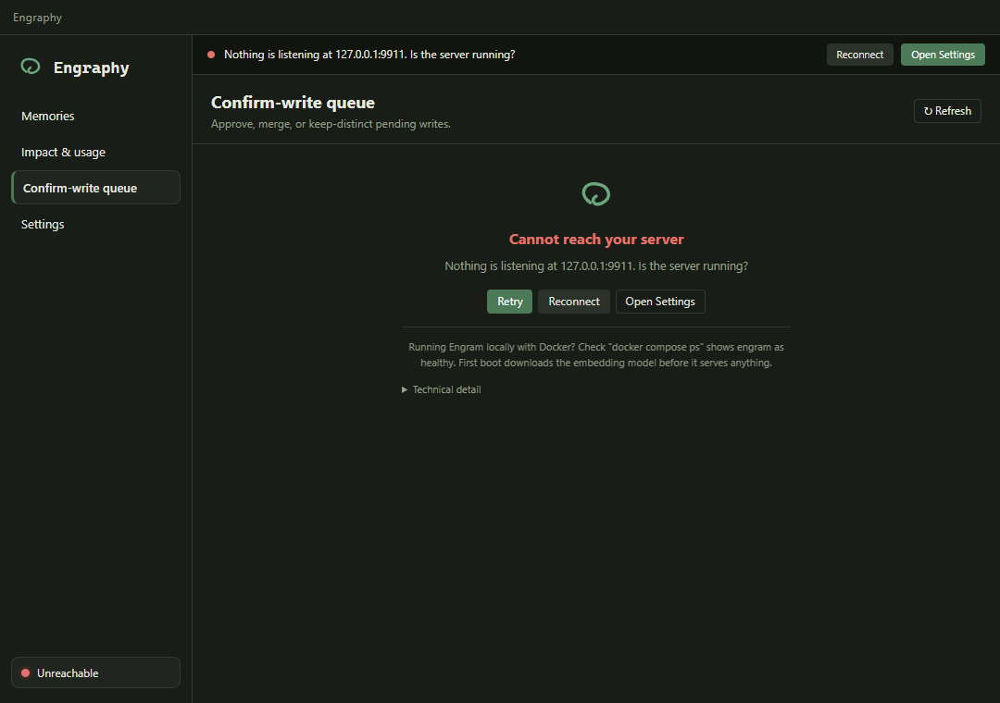
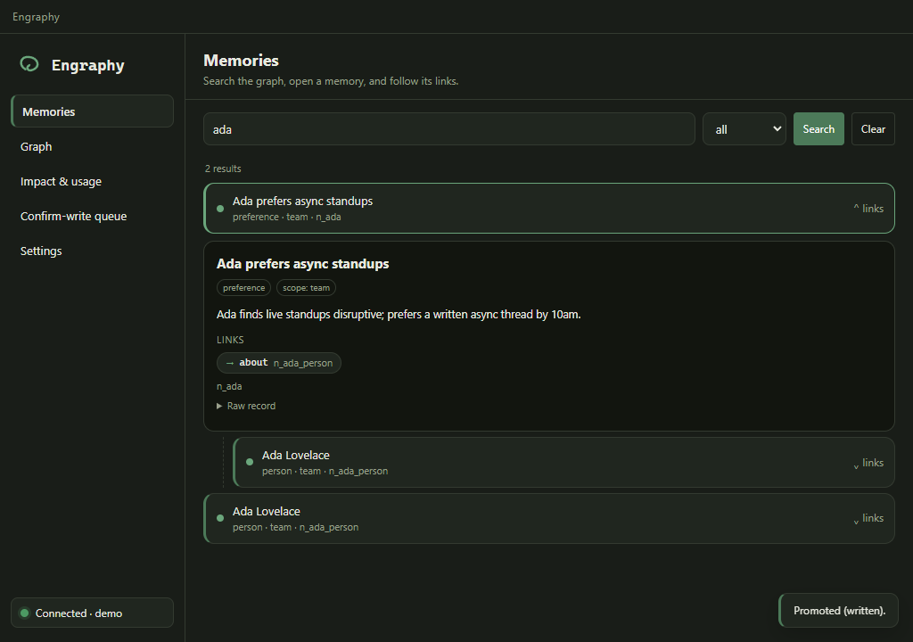
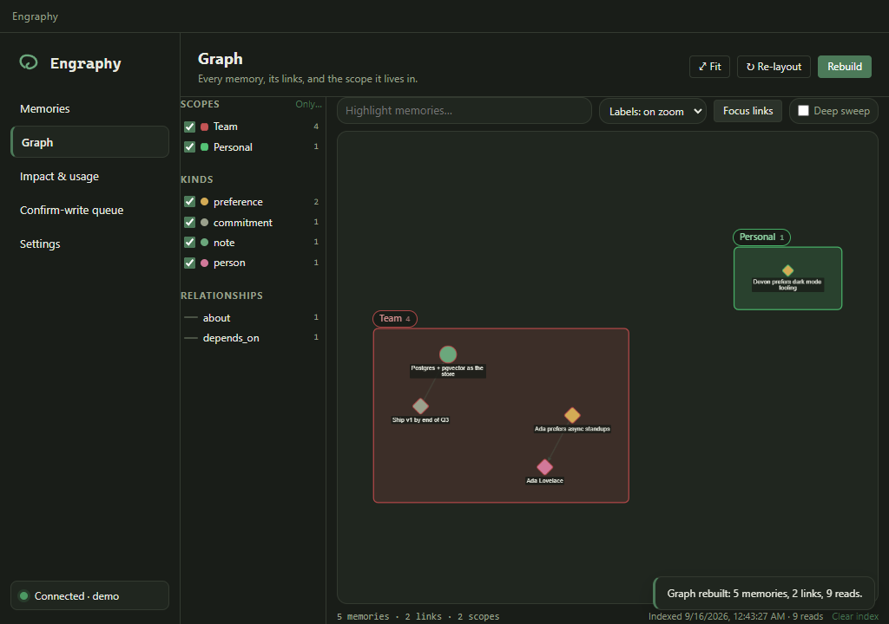
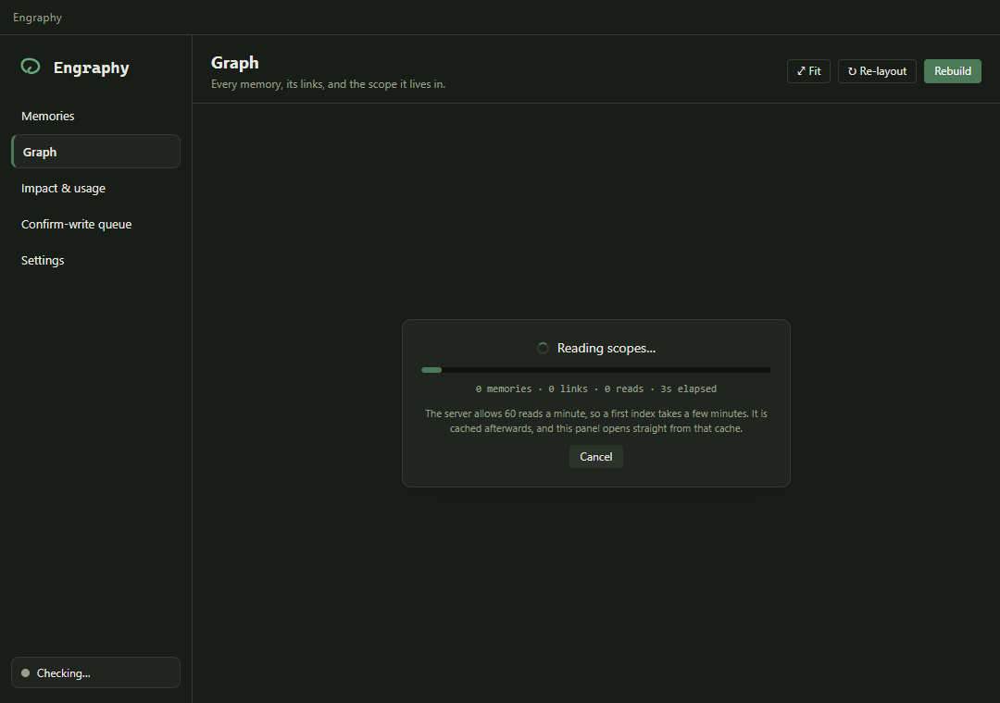

# Engraphy desktop

A small cross-platform desktop app that gives people who live in chat windows the
same core Engraphy surface as the VS Code extension, without an IDE: browse your
memories, see impact stats, and review the confirm-write queue (approve / merge /
keep-distinct) against your Engraphy MCP server.

Built with **Electron**. See `DECISIONS.md` for why Electron over Tauri and every
other choice.

Light (the brand default) and dark, following the OS colour scheme:




## What it does

- **Memories** — lists what your token can read as soon as you open it, then
  search the graph, open a memory to see its full record (body, attributes,
  links, history), and follow its links one hop at a time.
- **Graph** — the whole memory graph drawn as a graph: every memory labelled,
  every link inspectable, and each scope its own coloured, named region so the
  space reads as distinct areas rather than one blob. Pan/zoom, filter by scope
  or kind, highlight by title, and click a memory to read its record and walk its
  links. See [Graph](#graph) for how it is built and what it costs.
- **Impact & usage** — the stats dashboard (duplicates prevented, memory reused,
  answer rate, and more), with space/you and 7/14/30-day toggles.
- **Confirm-write queue** — pending duplicates with candidate + similarity, and
  Approve (keep distinct) / Merge into. Plus the inbox: Promote (in-app authoring
  form) and Discard.
- **Settings** — server URL, token, and space label, with live validation and a
  **Test connection** button that probes without saving. The token is stored in
  your OS keychain.
- **First-run setup** — a three-step guide for someone who has never run a
  memory server.
- **Connection health** — a live indicator that reflects whether the app can
  actually *read*, not just whether the server answers a ping.

### When something is wrong

The server is often not running, so every panel has a real state for that. The
app distinguishes three different problems, because they have three different
fixes:

| State | What it means | What the app tells you |
| --- | --- | --- |
| **No server set** | No URL configured | Opens the setup guide |
| **Unreachable** | Nothing answered at that address | Retry / Reconnect, and the Docker check |
| **Token needed / rejected** | The server is running and refused you | Go fix the token, *not* the server |

That last row is the one that matters most in practice. Engraphy's `/healthz` is
unauthenticated, so a server you hold no valid token for still answers it. The
app therefore probes an authenticated call as well, and the health badge only
goes green when a real read succeeds.

Both screenshots below are real: captured by the smoke harness against a live
Engraphy server with no token, and against a dead port.




## Requirements

- Node.js 18+ (built and tested on Node 24).
- No Rust, no Python, no Docker needed to build or run the app itself. (You do
  need a reachable Engraphy server to see real data; a dev stub is
  included so you can run without one.)

## Run it in development

```sh
npm install

# Terminal A — start the bundled dev stub server (fake Engraphy on :8000)
npm run stub

# Terminal B — build and launch the app
npm start
```

The app defaults to `http://127.0.0.1:8000/mcp/`, which is exactly where the stub
listens, so it connects out of the box. Open **Settings** to point it at a real
server instead.

To iterate on the main/preload code with rebuild-on-save: `npm run watch` (then
`electron .` in another terminal). The renderer is plain HTML/CSS/JS — edit and
relaunch.

Useful stub flags:

```sh
STUB_PORT=8010 npm run stub       # run beside a real server on :8000
STUB_EMPTY=1 npm run stub         # a brand-new space: connected, but nothing stored
STUB_DELAY_MS=4000 npm run stub   # slow responses, to see the loading skeletons
```

## Tests

```sh
npm test            # 169 unit checks over every pure module
npm run smoke       # drives the real app through 8 scenarios (97 checks)
                    # plus opt-in: --only=graph (21 checks, minutes long)
npm run smoke:packaged   # same, against the built app in release/
```

`npm test` covers the pure modules with plain Node asserts. It includes the VS
Code extension's own suite verbatim, which acts as a **re-sync guard**: the files
under `src/main/client/` are copied from the extension and frozen, so if a future
re-copy changes their behaviour these fail first.

`npm run smoke` is the part unit tests cannot do. It launches the actual app once
per scenario, in a throwaway user-data profile, drives it, and asserts on what
each panel rendered:

| Scenario | Setup | Proves |
| --- | --- | --- |
| `connected` | dev stub | cards, tiles, search results, approve works |
| `empty` | stub with `STUB_EMPTY=1` | empty states, not errors |
| `unauthorized` | a **live** Engraphy server with no token | says "token", not "start a server" |
| `unreachable` | a dead port | recovery block with a retry |
| `unconfigured` | no URL at all | offers setup |
| `onboarding` | fresh profile | opens once, and only once |
| `loading` | stub with `STUB_DELAY_MS` | skeletons render while reads are in flight |
| `live` | a **real** server + valid token | a genuine authorized read renders |
| `settings` | stub | token round-trips through the keychain and never reaches the renderer |
| `graph` | a **real** server + valid token | opt-in; indexes and renders the whole graph |

The `connected` scenario drives the whole review surface: search, open a record,
follow its links, Approve, Merge, and Promote on both an item that carries a
scope and one that does not. **Discard is not covered**: it confirms through a native
`dialog.showMessageBox`, which blocks the main process and cannot be driven from
the renderer, so verify that one by hand.

Every scenario also asserts the window is not blank and nothing crashed. Add
`--shots` to write the screenshots in `docs/`.

The `unauthorized` scenario needs a live server (default
`http://127.0.0.1:8000`). It is **skipped, not failed**, when nothing is
listening, so the suite still runs with Docker down.

The `live` scenario is the one that proves a real authorized read renders. It
needs a token, which never lives in the repo, so pass one in and it is skipped
when unset:

```sh
ENGRAPHY_LIVE_TOKEN=<token> ENGRAPHY_LIVE_SPACE=<label> npm run smoke -- --only=live
```



`graph` is **excluded from the default run** and only runs when named. It indexes
the entire graph, which takes minutes and drains the token's 60-reads-per-minute
budget — enough that whatever scenario ran next against the same server got
`RATE_LIMITED` and failed three of `live`'s read assertions:

```sh
ENGRAPHY_LIVE_TOKEN=<token> ENGRAPHY_LIVE_SPACE=<label> npm run smoke -- --only=graph
```

It asserts on cytoscape's own element counts rather than the DOM, so a canvas
that laid out nothing cannot pass by having the side rail render.

## Graph



Each scope is a cytoscape **compound parent**, so the layout engine itself
keeps the regions apart and each one is sized by how much it holds. Scope
names are HTML chips drawn over the canvas rather than in-scene labels, so
they stay readable at the zoom that fits the whole graph.

### What the first index looks like



The card names the phase and the scope it is on, counts what it has discovered
so far, and runs a bar that only ever moves forward. The spinner keeps turning
through the rate-limit pauses, which are called out with a live countdown, so a
minute of deliberate waiting cannot be mistaken for a hang. **Cancel** stops it
and keeps whatever graph was already on screen.

If the index fails, it ends on an error with a **Try again**, never on a spinner.
A rebuild that fails leaves the previous graph up and says so in a strip above
the canvas.

### Why it has to be indexed first

Engraphy has **no whole-graph read**, and every read it does have is capped on
purpose: `search` returns at most 25 results, `traverse` walks at most 50 rows,
and `briefing` sections cap at 10. The whole picture therefore has to be
assembled out of a few hundred small reads, and the server allows **60 reads a
minute per token** — so a first index takes a few minutes. It is written to
`engraphy-graph-<space>.json` beside your settings and the panel opens on that
cache instantly afterwards. **Rebuild** re-indexes.

### Indexing does not move your usage numbers

`search` is what the `stats` tool counts as `questions_asked`, and every result
it returns adds to `memory_reused`. Sweeping 16 scopes with it would add roughly
16 questions and 390 reuses — which, against this space's real 30-day totals of
48 and 268, would more than double the numbers on **Impact & usage**. Drawing a
picture must not corrupt the measurement, so the default index uses only
`briefing` and `traverse`, which the metrics engine explicitly does not count.

The **Deep sweep** switch in the graph toolbar turns the `search` pass on for the
next Rebuild. It finds memories that no link can reach, and it says plainly that
it counts towards your usage numbers. It is off by default, and it lives in the
toolbar rather than only on the first-run screen so it stays reachable once a
graph exists.

**Clear index** in the status line drops the cached graph and returns to the
build screen. It touches only the local cache file, never your memories.

### What the default index reaches

Measured against a live space of 239 memories / 437 links / 16 scopes:

| | Default | With deep sweep |
| --- | --- | --- |
| Memories | 234 of 239 | finds link-less memories the walk cannot |
| Links | 434 of 437 | |
| Scopes | 16 of 16 | |
| Reads | ~218, ~3.5 min | +16 `search` calls |
| Usage counters | untouched | moved |

The shortfall is real and is reported rather than hidden. A walk only ever
reaches what is linked to a seed, so a small **island** of memories linked only
to each other, in a scope whose briefing hints did not surface them, never
appears. Likewise a memory with more links than one 50-row read can return, whose
relationships cannot be split any finer, has a few links left undrawn — the
status line says `N link lists incomplete` when that happens.

`src/main/graphHarvest.ts` documents the algorithm and why each constraint picked
it, including why the walk runs at depth 2 rather than 3.

## Connect to a real server

1. Bring up an Engraphy server (see [devon-clarkk/engraphy](https://github.com/devon-clarkk/engraphy), Docker compose).
2. Mint a token: `engraphy-admin token create --space <space> --principal <you> --role readwrite`.
3. In the app: **Settings** -> paste the MCP URL (keep the trailing `/mcp/`) and
   the token -> **Test connection** -> **Save & connect**.

The setup guide (Help -> Set up Engraphy, or the link in Settings) walks through
the Docker bring-up if you do not have a server yet.

## Build the Windows installer (do this on Windows)

```sh
npm run dist:win
```

Output:

- **Installer:** `release/Engraphy Setup <version>.exe` (NSIS, ~82 MB, x64).
- **Unpacked app:** `release/win-unpacked/Engraphy.exe` (runs without installing).

Both artifacts were built and verified in this repo: `npm run smoke:packaged`
drives the packaged exe through every scenario.

The installer is **unsigned** — Windows SmartScreen will warn on first run until
code signing is added (see below).

## Build the macOS app + dmg (must be done ON a Mac)

electron-builder builds a macOS `.dmg`/`.app` using `hdiutil`, which only exists
on macOS. **You cannot cross-build the dmg from Windows.** On a Mac with Node
18+:

```sh
npm ci
CSC_IDENTITY_AUTO_DISCOVERY=false npm run dist:mac   # unsigned, no identity needed
```

Output (under `release/`):

- `Engraphy-<version>-arm64.dmg` and `Engraphy-<version>.dmg` (x64)
- the matching `.app` bundles under `release/mac-arm64/` and `release/mac/`

Notes:

- The macOS icon (`.icns`) is derived automatically from `build/icon.png` (now
  1024x1024, so the Retina layer is real rather than upscaled).
- `build/entitlements.mac.plist` is already in place. It is **required** once you
  sign: the hardened runtime blocks the writable-executable memory Chromium's
  JIT needs, so a signed build without `allow-jit` launches and immediately
  crashes.
- `darkModeSupport` is on, so the dark palette applies.
- To build only the host arch, add `--arm64` or `--x64`.

### Signing + notarization (left for Devon)

- **macOS:** provide a Developer ID Application identity (`CSC_LINK` /
  `CSC_KEY_PASSWORD`, or a keychain identity), set `APPLE_ID`,
  `APPLE_APP_SPECIFIC_PASSWORD` and `APPLE_TEAM_ID`, flip `mac.notarize` to
  `true` in `package.json`, and run `npm run dist:mac` without
  `CSC_IDENTITY_AUTO_DISCOVERY=false`.
- **Windows:** provide a code-signing certificate (`CSC_LINK` /
  `CSC_KEY_PASSWORD` or a signtool setup) so the NSIS installer and exe are
  signed and SmartScreen stops warning.

No secrets are baked into this repo. The token is entered by the user at runtime
and stored in the OS keychain.

## Project layout

```
engraphy-desktop/
  esbuild.js                 bundles main + preload + stub to CJS
  scripts/
    copy-renderer.js         copies the renderer tree into out/ (+ SVG/JS guards,
                             vendors the graph libs)
    make-icons.js            generates build/icon.png + icon.ico from the loop mark
    test-client.js           unit checks over every pure module
    smoke.js                 drives the real app through each connection scenario
  src/
    main/
      main.ts                app lifecycle, window, menu, all IPC + MCP orchestration
      settings.ts            settings persistence (safeStorage for the token)
      connection.ts          error classification, connection state, health VM
      validation.ts          per-field settings validation + normalization
      explorerModel.ts       search/traverse/get result shaping
      graphModel.ts          graph snapshot shapes, envelope parsing, cache parsing
      graphHarvest.ts        whole-graph index over the capped reads (rate-paced)
      windowState.ts         window bounds restore (display-aware)
      ipcResult.ts           the discriminated invoke contract
      client/                COPIED VERBATIM from the extension (v0.4.0), FROZEN:
        mcpClient.ts           MCP Streamable HTTP client
        toolResult.ts          result parsing + arg builders (trust boundary)
        statsModel.ts          stats wire types + view-model
        webviewMessages.ts     card view-models + strict message parsing
    preload/preload.ts       contextBridge IPC surface (sandboxed)
    renderer/
      index.html             app shell (CSP, title bar, sidebar, banner, 4 panels)
      app.js                 shell: nav, theme, health, banner, toasts, mounts views
      css/theme.css          brand palette mapped onto --vscode-* variables
      css/desktop.css        release chrome: title bar, states, onboarding
      css/{confirm,stats}.css   PORTED from the extension media/
      views/states.js        shared loading / empty / error / recovery components
      views/{confirm,stats}.js  PORTED from the extension media/
      views/{explorer,settings,onboarding}.js  written fresh for the desktop app
      views/graph.js         cytoscape graph viewer (clusters, labels, inspector)
      css/graph.css          graph panel chrome, rail, inspector, scope chips
      vendor/                cytoscape + fcose, copied from node_modules at build
  stub/stub-server.ts        dev-only SDK-based fake Engraphy server
  build/                     app icons + macOS entitlements
  DECISIONS.md               why Electron, and every other choice
```

## Provenance

The `src/main/client/*` files and the ported renderer CSS/JS come from an
earlier webview build of the VS Code extension (v0.4.0). They were **copied
in**, not imported, so this app does not couple to the extension's build. The
copied client is frozen; desktop-only behaviour lives in sibling modules. See
`DECISIONS.md` §3 and §12.
